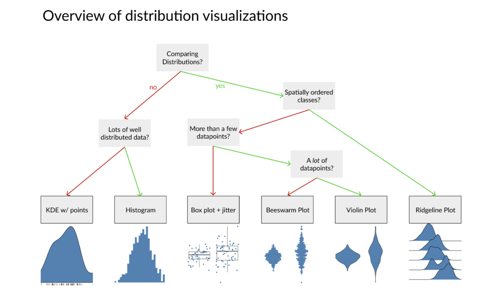

# Scatterplot 

## Load Library
```{r}
library(ggplot2)
```


## Loading dataset
```{r}
head(iris)
```

## Basic scatter plot
```{r}
# The iris dataset   is provided natively by R
#head(iris)
 
# basic scatterplot
ggplot(iris, aes(x=Sepal.Length, y=Sepal.Width)) + 
    geom_point()
```

## Changing aesthetics
```{r}
# Changing size
ggplot(iris, aes(x=Sepal.Length, y=Sepal.Width)) + 
    geom_point(size=6)
```


```{r}
library(dplyr)
glimpse(iris)
```


```{r}
# Coloring by another variable
ggplot(iris, aes(x=Sepal.Length, y=Sepal.Width, color=Species)) + 
    geom_point()
```

```{r}
# Grouping by alpha
ggplot(iris, aes(x=Sepal.Length, y=Sepal.Width, alpha=Species)) + 
    geom_point()

# pick the most useful grouping!
```

```{r}
# Grouping by shape
ggplot(iris, aes(x=Sepal.Length, y=Sepal.Width, shape=Species)) + 
    geom_point()

# pick the most useful grouping!
```

```{r}
# Size --> buuble plot!!!
ggplot(iris, aes(x=Sepal.Length, y=Sepal.Width, size=Species)) + 
    geom_point() 
```

```{r}
# Combine all
# A basic scatterplot with color depending on Species
ggplot(iris, aes(x=Sepal.Length, y=Sepal.Width, shape=Species, alpha=Species, size=Species, color=Species)) + 
    geom_point() 
```

## Adding linear regression
```{r}
# Create dummy data
data <- data.frame(
  cond = rep(c("column_1", "column_2"), each=10), 
  x = 1:100 + rnorm(100,sd=9), 
  y = 1:100 + rnorm(100,sd=16) 
)
```

```{r}
data
```

```{r}
# Basic scatter plot
ggplot(iris, aes(x=Sepal.Length, y=Sepal.Width)) + 
  geom_point() 

# With linear model
ggplot(iris, aes(x=Sepal.Length, y=Sepal.Width)) + 
  geom_point() +
  geom_smooth(method=lm, color="red", se=FALSE) 

# With linear model, plus confidence interval
ggplot(iris, aes(x=Sepal.Length, y=Sepal.Width)) + 
  geom_point() +
  geom_smooth(method=lm , color="red", se=TRUE) 
```


## JITTERING
```{r}
p <- ggplot(mpg, aes(cyl, hwy))
p + geom_point(aes())
```

```{r}
p + geom_jitter()
```

```{r}
# Add aesthetic mappings
p + geom_jitter(aes(colour = class))
```

```{r}
ggplot(mpg, aes(cty, hwy)) + geom_jitter(width = 0.5, height = 0.5)
```


## BUBBLE THING

```{r}
# The dataset is provided in the gapminder library
library(gapminder)
data <- gapminder %>% filter(year=="2007") %>% dplyr::select(-year)

# Most basic bubble plot
ggplot(data, aes(x=gdpPercap, y=lifeExp, size = pop)) +
    geom_point(alpha=0.7)
```

```{r}
# Another bubble plot
# Most basic bubble plot
data %>%
  arrange(desc(pop)) %>%
  mutate(country = factor(country, country)) %>%
  ggplot(aes(x=gdpPercap, y=lifeExp, size=pop, color=continent)) +
    geom_point(alpha=0.5) +
    scale_size(range = c(.1, 24), name="Population (M)")
```


## Case Study for Analysis
```{r}
who_disease <- read.csv("who_disease.csv")
```

```{r}
head(who_disease)
```
Picking few countries
```{r}
interestingCountries <- c("NGA", "SDN", "FRA", "NPL", "MYS", "TZA", "YEM", "UKR", "BGD", "VNM")
```

Picking 2 year to compare
```{r}
who_subset <- who_disease %>% 
	filter(
		countryCode %in% interestingCountries,
		disease == 'measles',
		year %in% c(2006, 2016) 
	) %>% 
	mutate(year = paste0('cases_', year)) %>% 
	tidyr::spread(year, cases)

?spread
```

```{r}
head(who_subset)
```


```{r}
write.csv(who_subset, 'who_subset.csv', row.names = FALSE)
```

```{r}
(who_subset <- read.csv("who_subset.csv"))
```

Shows pattern with log scale
```{r}
# True value without logaritmic
ggplot(who_subset, aes(x = cases_2006, y = country)) +
	geom_point()

# With logaritmic
ggplot(who_subset, aes(x = log10(cases_2006), y = country)) +
	geom_point()

# With logaritmic and ordering
ggplot(who_subset, aes(x = log10(cases_2006), y = reorder(country, cases_2006))) +
	geom_point()

ggplot(who_subset, aes(x = cases_2006, y = reorder(country, cases_2006))) +
	geom_point()
```

```{r}
# Check the increaseness of 2016 and 2006 by log 2, log2 = 1 means there is increase by 2 times
who_subset %>% 
	# calculate the log fold change between 2016 and 2006
	mutate(logFoldChange = log2(cases_2016/cases_2006)) %>% 
	# set y axis as country ordered with respect to logFoldChange
	ggplot(aes(x = logFoldChange, y = reorder(country, logFoldChange))) +
	geom_point() +
	# add a visual anchor at x = 0
	geom_vline(xintercept = 0)


```
Ukraine berkurang signifikan dibanding yang lain.

```{r}
who_subset %>% 
	mutate(logFoldChange = log2(cases_2016/cases_2006)) %>%
	ggplot(aes(x = logFoldChange, y = reorder(country, logFoldChange))) +
	geom_point() +
	geom_vline(xintercept = 0) +
  facet_grid(region~.)

# scale y only shown that region
who_subset %>% 
	mutate(logFoldChange = log2(cases_2016/cases_2006)) %>%
	ggplot(aes(x = logFoldChange, y = reorder(country, logFoldChange))) +
	geom_point() +
	geom_vline(xintercept = 0) +
  facet_grid(region~., scale = 'free_y')
```

```{r}
# Make point visualization form pertussis disease in 1980 where the region is on America!
```


```{r}
amr_pertussis <- who_disease %>% 
	filter(   # filter data to our desired subset
		region == 'AMR', 
		year == 1980, 
		disease == 'pertussis'
	)
```

```{r}
amr_pertussis %>% filter(cases > 0) %>% 
	ggplot(aes(x = reorder(country, cases), y = cases)) + 
	# switch geometry to points and set point size = 2
	geom_point(size=2) + 
	# change y-axis to log10. 
	scale_y_log10() +
	# add theme_minimal()
	theme_minimal() +
	coord_flip()
```


# Boxplot and Violin
```{r}
md_speeding <- read.csv('md_speeding.csv')
```

```{r}
head(md_speeding, row.names=FALSE)
```

# BEYOND BOXPLOT for Distribution
```{r}
md_speeding %>% 
    filter(vehicle_color == 'RED') %>%
    # Map x and y to gender and speed columns respectively
    ggplot(aes(x = gender, y = speed)) + 
    # add a boxplot geometry
    geom_boxplot() +
    # give plot supplied title
    labs(title = 'Speed of red cars by gender of driver')
```


```{r}
md_speeding %>% 
    filter(vehicle_color == 'RED') %>%
    ggplot(aes(x = gender, y = speed)) + 
    # add jittered points with alpha of 0.3 and color 'steelblue'
    geom_jitter(color = 'steelblue', alpha = 0.3) +
    # make boxplot transparent with alpha = 0
    geom_boxplot(alpha = 0) +
    labs(title = 'Speed of red cars by gender of driver')
```


```{r}
# remove color filter
md_speeding %>%
    ggplot(aes(x = gender, y = speed)) + 
    geom_jitter(alpha = 0.3, color = 'steelblue') +
    geom_boxplot(alpha = 0) +
    # add a facet_wrap by vehicle_color
    facet_wrap(~vehicle_color) +
    # change title to reflect new faceting
    labs(title = 'Speed of different car colors, separated by gender of driver')


#That's a lot of points drawn to the screen! Do you think that drawing each data point with the jitter function is a good idea here, or does it feel to crowded to you? A lot can depend on the data's form so it's always good to experiment!
```


```{r}
# Load library for making beeswarm plots
library(ggbeeswarm)
```

```{r}
md_speeding %>% 
    filter(vehicle_color == 'RED') %>%
    ggplot(aes(x = gender, y = speed)) + 
    # change point size to 0.5 and alpha to 0.8
    geom_beeswarm(cex = 0.5, alpha = 0.8) +
    # add a transparent boxplot on top of points
    geom_boxplot(alpha = 0)

?geom_beeswarm
```

```{r}
md_speeding %>% 
    filter(vehicle_color == 'RED') %>%
    ggplot(aes(x = gender, y = speed)) + 
    # Replace beeswarm geometry with a violin geometry with kernel width of 2.5
    geom_violin(bw = 2.5) +
    # add individual points on top of violins
    geom_point(alpha = 0.3, size = 0.5)

?geom_violin
```


```{r}
md_speeding %>% 
    filter(vehicle_color == 'RED') %>%
    ggplot(aes(x = gender, y = speed)) + 
    geom_violin(bw = 2.5) +
    # add a transparent boxplot and shrink its width to 0.3
    geom_boxplot(alpha = 0, width = 0.3) +
    # Reset point size to default and set point shape to 95
    geom_point(shape = 95) +
    # Supply a subtitle detailing the kernel width
    labs(subtitle = 'Gaussian kernel SD = 2.5')

#You've encoded a lot of information into a single plot here! You have summary statistics, density estimates, and raw points. For many scenarios this may be too much, but sometimes, especially when exploring a dataset, it can be great to glean so much in one glance.
```

```{r}
md_speeding %>% 
    ggplot(aes(x = gender, y = speed)) + 
    # replace with violin plot with kernel width of 2.5, change color argument to fill 
    geom_violin(alpha = 0.3, color = 'steelblue', fill = 'steelblue', bw = 2.5) +
    # reduce width to 0.3
    geom_boxplot(alpha = 0, width = 0.3) +
    facet_wrap(~vehicle_color) +
    labs(
        title = 'Speed of different car colors, separated by gender of driver'
        # add a subtitle w/ kernel width
        , subtitle = 'Gaussian kernel width: 2.5'
    )

#When swapping the jittered points for a violin plot in these large-comparison situations, you still hear from all the data, but your plot becomes a lot less busy. Do you think it works well in this case compared to the more basic boxes + jitter?
```
## ggridges
```{r}
library(ggridges)
```

```{r}
md_speeding %>% 
    mutate(day_of_week = factor(day_of_week, levels = c("Mon","Tues","Wed","Thu","Fri","Sat","Sun") )) %>% 
    ggplot(aes( x = percentage_over_limit, y = day_of_week)) + 
    # Set bandwidth to 3.5
    geom_density_ridges(bandwidth = 3.5) +
    # add limits of 0 to 150 to x-scale
    scale_x_continuous(limits = c(0, 150)) 
    # provide subtitle with bandwidth
    labs(subtitle = 'Gaussian kernel SD = 3.5')
```

```{r}
md_speeding %>% 
    mutate(day_of_week = factor(day_of_week, levels = c("Mon","Tues","Wed","Thu","Fri","Sat","Sun") )) %>% 
    ggplot(aes( x = percentage_over_limit, y = day_of_week)) + 
    # make ridgeline densities a bit see-through with alpha = 0.7
    geom_density_ridges(bandwidth = 3.5, alpha = 0.7) +
    # set expand values to c(0,0)
    scale_x_continuous(limits = c(0,150), expand  = c(0,0)) +
    labs(subtitle = 'Guassian kernel SD = 3.5') +
    # remove y axis ticks by setting equal to element_blank()
    theme(axis.ticks.y = element_blank() )
```


```{r}
md_speeding %>% 
    mutate(day_of_week = factor(day_of_week, levels = c("Mon","Tues","Wed","Thu","Fri","Sat","Sun") )) %>% 
    ggplot(aes( x = percentage_over_limit, y = day_of_week)) + 
    geom_point(
        alpha = 0.2,  # make semi-transparent with alpha = 0.2
        shape = '|',  # turn points to vertical lines with shape = '|'
        position = position_nudge(y = -0.05) # nudge the points downward by 0.05
    ) +
    geom_density_ridges(bandwidth = 3.5, alpha = 0.7) +
    scale_x_continuous(limits = c(0,150), expand  = c(0,0)) +
    labs(subtitle = 'Guassian kernel SD = 3.5') +
    theme( axis.ticks.y = element_blank() )
```


```{r pressure, echo=FALSE, fig.cap="A caption", out.width = '25%'}

```


# LEAFLET

```{r}
library(leaflet)
```


```{r}
leaflet() %>%
  addTiles()
```

```{r}
## Change addTiles() to addProviderTiles() and set the provider argument to "CartoDB"
leaflet() %>% 
    addProviderTiles(provider = "CartoDB") #ESRI #"CartoDB.PositronNoLabels"
```


```{r}
# Map with CartoDB tile centered on DataCamp's NYC office with zoom of 6
leaflet()  %>% 
    addProviderTiles("CartoDB")  %>% 
    setView(lng = -73.98575, lat = 40.74856, zoom = 6)
```


```{r}
leaflet()  %>% 
    addProviderTiles("CartoDB")  %>% 
    addMarkers(lng = 106.827153, lat =  -6.175392)
```

```{r}
leaflet()  %>% 
    addProviderTiles("CartoDB")  %>% 
    addMarkers(lng = 106.827153, lat =  -6.175392) %>% 
    setView(lng = 106.827153, lat =  -6.175392, zoom = 12)
```

```{r}
leaflet()  %>% 
    addProviderTiles("CartoDB")  %>% 
    addMarkers(lng = 106.827153, lat =  -6.175392, popup = 'Monas') %>% 
    setView(lng = 106.827153, lat =  -6.175392, zoom = 12)
```


```{r}
leaflet()  %>% 
  addProviderTiles("CartoDB")  %>% 
  addMarkers(lng = 106.827153, lat =  -6.175392, popup = 'Monas') %>% 
  setView(lng = 106.827153, lat =  -6.175392, zoom = 12) %>%
  clearBounds() #
        #clearMarkers()  %>% 
        
```
## OTHER DATASET
```{r}
ipeds <- read.csv('ipeds.csv')
head(ipeds)
```

```{r}
library(tidyverse)
```


```{r}
# Remove colleges with missing sector information
ipeds <- 
    ipeds %>% 
    drop_na()
```

```{r}
ipeds_for_public <- ipeds %>%
        filter(sector_label == "Public")
leaflet()  %>% 
    addProviderTiles("CartoDB")  %>% 
    addMarkers(lng = ipeds_for_public$lng, lat = ipeds_for_public$lat) 
    #clearMarkers() %>%
    #addCircleMarkers(lng = ipeds_for_public$lng, lat = ipeds_for_public$lat)
```

```{r}
leaflet()  %>% 
    addProviderTiles("CartoDB")  %>% 
    addMarkers(lng = ipeds_for_public$lng, lat = ipeds_for_public$lat) %>%
    clearMarkers() %>%
    addCircleMarkers(lng = ipeds_for_public$lng, lat = ipeds_for_public$lat, radius = 2, color = "red")
```


```{r}
leaflet()  %>% 
    addProviderTiles("CartoDB")  %>% 
    addCircleMarkers(data = ipeds_for_public, radius = 2, popup = ~name)
```

```{r}
leaflet()  %>% 
    addProviderTiles("CartoDB")  %>% 
    addCircleMarkers(data = ipeds_for_public, radius = 2, popup = ~paste0("<b>", name, "</b>", "<br/>", sector_label)) #bold and break
```

```{r}
leaflet()  %>% 
    addProviderTiles("CartoDB")  %>% 
    addCircleMarkers(data = ipeds_for_public, radius = 2, label = ~paste0(name, " (", sector_label, ")"))
```

```{r}
ipeds_100 <- head(ipeds, n = 100)
```

```{r}
map <- leaflet() %>% 
    addProviderTiles("CartoDB")
map
```

```{r}
# Make a color palette called pal for the values of `sector_label` using `colorFactor()`  
# Colors should be: "red", "blue", and "#9b4a11" for "Public", "Private", and "For-Profit" colleges, respectively
pal <- colorFactor(palette = c("red", "blue", "#9b4a11"), 
                   levels = c("Public", "Private", "For-Profit"))

# Add circle markers that color colleges using pal() and the values of sector_label
map2 <- 
    map %>% 
        addCircleMarkers(data = ipeds_100, radius = 2, 
                         color = ~pal(sector_label), 
                         label = ~paste0(name, " (", sector_label, ")"))

# Print map2
map2
```

```{r}
map2 %>% 
    addLegend(pal = pal, 
              values = c("Public", "Private", "For-Profit"))
```

```{r}
# Customize the legend
map2 %>% 
    addLegend(pal = pal, 
              values = c("Public", "Private", "For-Profit"),
              # opacity of .5, title of Sector, and position of topright
              opacity = 0.5, title = "Sector", position = "topleft")
```


## SP

```{r}
library(sp)

?sp
```


```{r}
load(file = "nc_zips.rda")
```


```{r}
# map the polygons in shp
shp %>% 
    leaflet() %>% 
    addTiles() %>% 
    addPolygons()

```


```{r}
# map the polygons in shp
shp %>% 
    leaflet() %>% 
    addTiles() %>% 
    addPolygons()

# which zips were not in the income data?
shp_na <- shp[is.na(shp$mean_income),]

```

```{r}
nc_income <- read.csv('mean_income_by_zip_nc.csv')
head(nc_income)
```

```{r}
nc_income$zipcode <- as.factor(nc_income$zipcode)
```


```{r}
# Summarize the nc_income data
summary(nc_income)

# Left join nc_income onto shp@data and store in shp_nc_income
shp_nc_income <- shp@data %>% 
                left_join(nc_income, by = c("GEOID10" = "zipcode"))

# Print the number of missing values of each variable in shp_nc_income
shp_nc_income  %>%
  summarize_all(funs(sum(is.na(.))))
```

```{r}
# map the polygons in shp
shp %>% 
    leaflet() %>% 
    addTiles() %>% 
    addPolygons()

# which zips were not in the income data?
shp_na <- shp[is.na(shp$mean_income),]

# map the polygons in shp_na
shp_na %>% 
    leaflet() %>% 
    addTiles() %>% 
    addPolygons()
 
```

```{r}
shp_nc_income$mean_income
```


```{r}
# summarize the mean income variable
summary(shp_nc_income$mean_income)
```

```{r}
# subset shp to include only zip codes in the top quartile of mean income
high_inc <- shp[!is.na(shp_nc_income$mean_income) & shp_nc_income$mean_income > 55917,]
```

```{r}
# map the boundaries of the zip codes in the top quartile of mean income
high_inc %>%
  leaflet() %>%
  addTiles() %>%
  addPolygons()
```

```{r}
# Create a logged version of the nc_pal color palette
#nc_pal <- colorNumeric("YlGn", domain = log(high_inc@data$mean_income))

# apply the nc_pal
#high_inc %>%
  #leaflet() %>%
  #addProviderTiles("CartoDB") %>%
  #addPolygons(weight = 1, color = ~nc_pal(log(mean_income)), fillOpacity = 1,
              #label = ~paste0("Mean Income: ", dollar(mean_income)),
              #highlightOptions = highlightOptions(weight = 5, color = "white", #bringToFront = TRUE))
```


```{r}
# Print the slot names of `wealthy_zips`
#slotNames(wealthy_zips)
```

```{r}
# Print a summary of the `mean_income` variable
#summary(wealthy_zips@data$mean_income)
```

```{r}
# plot zip codes with mean incomes >= $200k
```

```{r}
# plot zip codes with mean incomes >= $200k
#wealthy_zips %>% 
  #leaflet() %>% 
  #addProviderTiles("CartoDB") %>% 
  # set color to green and create Wealth Zipcodes group
  #addPolygons(weight = 1, fillOpacity = .7, color = "green",  group = "Wealthy Zipcodes", 
              #label = ~paste0("Mean Income: ", mean_income),
              #highlightOptions = highlightOptions(weight = 5, color = "white", bringToFront = TRUE))
```

```{r}
# Add polygons using wealthy_zips
#wealthy_zips %>% 
  #leaflet() %>% 
  #addProviderTiles("CartoDB") %>% 
   #addPolygons(data = wealthy_zips, weight = 1, fillOpacity = .5, color = "Grey",  group = "Wealthy Zip Codes", 
              #label = ~paste0("Mean Income: ", mean_income),
              #highlightOptions = highlightOptions(weight = 5, color = "white", bringToFront = TRUE)) %>% 
    # Update layer controls including "Wealthy Zip Codes"
    #addLayersControl(baseGroups = c("OSM", "Carto", "Esri"), 
                         #overlayGroups = c("Public", "Private", "For-Profit", "Wealthy Zip Codes"))     

```


